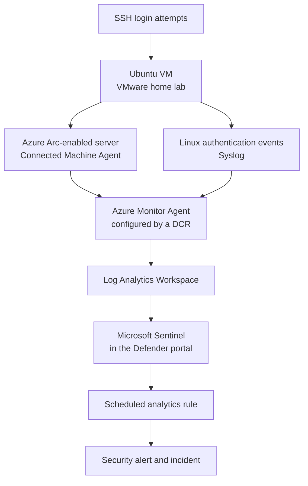

# Azure Arc SSH Brute Force Detection Lab

For this project, I connected a locally hosted Ubuntu virtual machine in VMware to Microsoft Azure using Azure Arc-enabled Servers. I deployed Azure Monitor Agent and configured a Data Collection Rule to collect Linux Syslog authentication events and send them to a Log Analytics Workspace. I then enabled Microsoft Sentinel on the workspace, generated repeated failed SSH login activity, and used Kusto Query Language (KQL) to identify the source IP address, targeted account, hostname, and number of failed attempts. After confirming the query returned the expected activity, I created a working Microsoft Sentinel scheduled analytics rule through the Microsoft Defender portal. The main goal of this lab was to demonstrate how a Linux machine outside Azure can be connected to a cloud SIEM, monitored for suspicious authentication activity, and protected with a repeatable detection.

# Network Topology

The Ubuntu VM remained in my local VMware environment. The Azure Connected Machine Agent registered it as an Azure Arc-enabled server and allowed Azure extensions, including Azure Monitor Agent, to be deployed to it. The Data Collection Rule defined which Linux Syslog events Azure Monitor Agent collected and sent to the Log Analytics Workspace. Microsoft Sentinel analyzed the stored data, while the Microsoft Defender portal provided the interface where I investigated the logs and managed the scheduled analytics rule.

# Creating the Azure Environment

To begin, I created a dedicated resource group named `rg-detectlab` to keep the Azure Arc, monitoring, and Microsoft Sentinel resources for the lab organized in one place.

I then started the Azure Arc server onboarding process for the Ubuntu machine.

Next, I created the Log Analytics Workspace that would store the Linux Syslog events collected from the Ubuntu VM.

I enabled Microsoft Sentinel on the workspace so the collected logs could be queried, analyzed, and used in an analytics rule.

# Connecting Ubuntu to Azure Arc

From the Azure portal, I generated the Azure Arc installation script and ran it in the Ubuntu terminal. The script downloaded and installed the Azure Connected Machine Agent.

I completed the authentication and connection process, which registered the local Ubuntu VM with the `rg-detectlab` resource group.

After the onboarding script completed, I confirmed that the machine appeared in Azure as the Arc-enabled server `user-VMware-Virtual-Platform` in the North Central US region.

I also confirmed that Azure could communicate with the connected machine before moving on to log collection.

# Configuring Linux Syslog Collection

With the Ubuntu machine connected through Azure Arc, I began configuring Azure Monitor Agent and the Data Collection Rule needed for Linux log ingestion.

I selected the Arc-enabled Ubuntu machine as the resource that the Data Collection Rule would monitor.

I then configured Linux Syslog as the data source and the Log Analytics Workspace as the destination. Azure Monitor Agent used this configuration to forward the selected authentication events into the `Syslog` table.

# Generating Failed SSH Login Activity

To test the monitoring pipeline, I generated repeated failed SSH logins against the Ubuntu system. These attempts produced `Failed password` messages in the Linux authentication logs, giving me realistic events to investigate in Microsoft Sentinel.

# Investigating the Events with KQL

In the Microsoft Defender portal, I opened Microsoft Sentinel logs and queried the `Syslog` table for messages containing `Failed password`. Seeing the Ubuntu events in the results confirmed that the collection path from the local VM to Log Analytics was working.

I refined the KQL logic to extract the source IP address and targeted account from each Syslog message. I then grouped repeated failures by hostname, source IP, and account so the activity could be evaluated as one pattern instead of as unrelated raw events.

# Creating the Microsoft Sentinel Analytics Rule

After validating the KQL query, I used it to create a scheduled analytics rule in Microsoft Sentinel through the Microsoft Defender portal.

I configured the rule to run automatically and evaluate the failed-login threshold defined by the query.

I reviewed the rule settings and completed the creation process so future matching activity could generate an alert and be grouped into an incident for investigation.

Finally, I confirmed that the completed SSH detection rule appeared in the Microsoft Defender portal. This verified that the rule was created successfully and that the lab's monitoring and detection workflow worked from end to end.

# Project Outcomes

- Connected a locally hosted Ubuntu VMware VM to Azure using Azure Arc-enabled Servers
- Registered the machine as `user-VMware-Virtual-Platform` in the `rg-detectlab` resource group
- Deployed Azure Monitor Agent and configured a Data Collection Rule for Linux Syslog ingestion
- Sent Ubuntu authentication events to a Log Analytics Workspace connected to Microsoft Sentinel
- Generated failed SSH login activity to validate the collection pipeline
- Used KQL to extract and summarize the source IP address, targeted account, hostname, timestamps, and failed-attempt count
- Created and enabled a working Microsoft Sentinel scheduled analytics rule through the Microsoft Defender portal
- Gained hands-on experience with Azure Arc, hybrid-cloud monitoring, SIEM investigation, KQL, and detection engineering

Built and Documented by Aluseni Waritay
