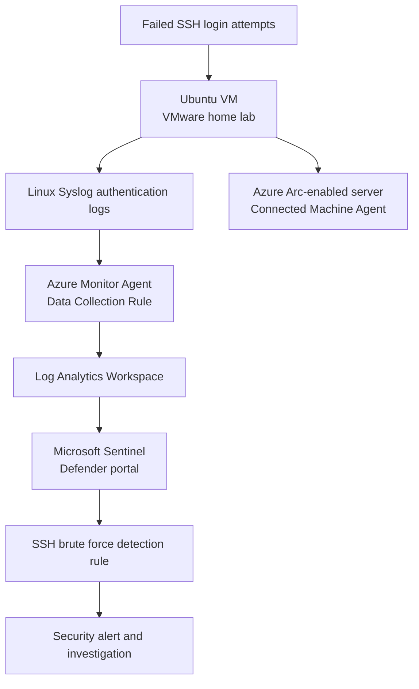

# Azure Arc SSH Brute Force Detection Lab

For this project, I connected an on-premises Ubuntu virtual machine running in VMware to Microsoft Azure using Azure Arc-enabled Servers. I then used Azure Monitor Agent and a Data Collection Rule to send Linux Syslog authentication data into a Log Analytics Workspace connected to Microsoft Sentinel. After confirming the logs were reaching Azure, I generated repeated failed SSH login activity and used Kusto Query Language (KQL) to identify the source IP address, targeted account, hostname, and number of failed attempts. I then created a working detection rule in the Microsoft Defender portal so repeated SSH authentication failures would automatically generate a security alert instead of remaining hidden in the raw logs. The lab's primary goal was to demonstrate how an on-premises Linux system can be brought into a cloud-based SOC workflow for centralized monitoring, threat detection, and investigation.

# Network Topology

The Ubuntu VM remained inside my local VMware environment while Azure Arc provided the connection between the machine and Azure. The Azure Connected Machine Agent registered the server as an Azure resource, while Azure Monitor Agent collected the selected Syslog events. A Data Collection Rule routed those events into the Log Analytics Workspace, where Microsoft Sentinel and the Microsoft Defender portal could query the data, apply the detection rule, and generate an alert.

# Creating the Azure Environment

To begin, I created a dedicated Azure resource group named `rg-detectlab`. Keeping the lab resources in one group made the Arc-enabled server, monitoring configuration, and security resources easier to organize and manage.

I then began setting up Azure Arc so my locally hosted Ubuntu VM could be managed and monitored as an Azure-connected resource.

Next, I created the monitoring resources required to centralize the Linux security logs in Azure.

I connected Microsoft Sentinel to the Log Analytics Workspace, giving me a cloud-based SIEM where I could query the Ubuntu logs and build detections.

# Connecting the Ubuntu VM with Azure Arc

From the Azure portal, I generated the Azure Arc onboarding script and ran it from the Ubuntu terminal. This downloaded the Azure Connected Machine Agent needed to connect the local server to Azure.

I completed the installation and authentication process from Ubuntu, allowing the machine to register with my Azure subscription and the `rg-detectlab` resource group.

After the script completed, I confirmed that the Ubuntu VM appeared in Azure as the Arc-enabled server `user-VMware-Virtual-Platform` in the North Central US region.

I also verified the server's connection and agent status to make sure Azure could communicate with the machine before configuring log collection.

# Configuring Linux Log Collection

With the Ubuntu VM connected, I deployed Azure Monitor Agent to the Arc-enabled server. This agent was responsible for collecting the Linux security events needed for the detection.

I created a Data Collection Rule to define which Linux logs should be collected and where they should be sent.

I selected the Arc-enabled Ubuntu server as the monitored resource and configured Linux Syslog as the data source. This ensured that SSH authentication activity would be forwarded to Azure.

Once the configuration was applied, I confirmed that the Azure Monitor Agent extension was successfully associated with the Ubuntu server and ready to forward events.

# Generating SSH Authentication Activity

To test the monitoring pipeline, I generated repeated failed SSH login attempts against the Ubuntu system. These attempts created failed-password messages in the Linux authentication logs, giving me realistic telemetry to search for in Microsoft Sentinel.

# Investigating the Logs with KQL

In the Microsoft Defender portal, I opened the Sentinel logs and queried the `Syslog` table for messages containing failed SSH passwords. This confirmed that the Ubuntu authentication events were successfully traveling from the local VM into Azure.

I refined the KQL query to extract useful investigation fields from each event, including the source IP address, targeted account, hostname, first-seen time, last-seen time, and total number of failed attempts.

The summarized results made the activity easier to investigate by grouping repeated login failures instead of requiring an analyst to review every raw Syslog message individually.

# Creating the Detection Rule in Microsoft Defender

After validating the query, I created a scheduled detection rule in the Microsoft Defender portal. The rule uses the KQL logic to identify multiple failed SSH logins from the collected Ubuntu Syslog data.

I configured the rule's detection settings so the activity would be evaluated automatically and produce a security alert when the failed-login threshold was reached.

The completed rule confirmed that the full detection pipeline worked from end to end: local Linux activity was collected from Ubuntu, forwarded through Azure Arc and Azure Monitor Agent, stored in Log Analytics, analyzed by Microsoft Sentinel, and surfaced through the Microsoft Defender portal.

# Project Outcomes

- Connected an on-premises Ubuntu VMware virtual machine to Azure using Azure Arc-enabled Servers
- Deployed Azure Monitor Agent and configured a Data Collection Rule for Linux Syslog ingestion
- Centralized Ubuntu SSH authentication logs in a Log Analytics Workspace connected to Microsoft Sentinel
- Generated failed SSH login activity to validate the complete telemetry pipeline
- Used KQL to extract and summarize the source IP, targeted account, hostname, timestamps, and failed-attempt count
- Created a working scheduled detection rule in the Microsoft Defender portal for repeated SSH authentication failures
- Gained hands-on experience with hybrid-cloud monitoring, SIEM log analysis, detection engineering, and security alerting

Built and Documented by Aluseni Waritay
